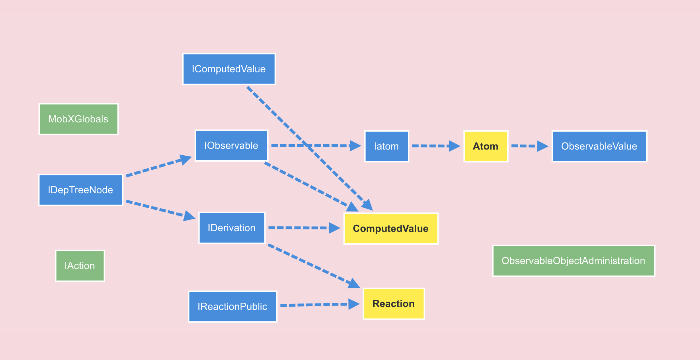

# HELLO Mobx

---
## Main Content
- Usage
- Ecology
- Source Code
- Performance

---
## Background
- Tedious message passing in component stack.
- A mechanism makes Test, Redo, Undo easier.

---
## Philosophy
Anything that can be derived from the application state, should be derived. Automatically.

---
## Usage
- Define state
- Register reaction
- Modify state

---?code=src/stores/basic.js&lang=javascript&color=#1E1F21&title=Basic Usage
@[3-5](Define state.)
@[9-11](Register reaction.)
@[13](Modify state.)

---?code=src/stores/observable.js&lang=javascript&color=#1E1F21&title=Define State
@[4-6](@observable)
@[7-9](@obserable.ref)
@[14-23](@observable vs @observable.ref)

---?code=src/stores/reaction.js&lang=javascript&color=#1E1F21&title=Register Reaction
@[9-11](autorun)
@[13-15](reaction)
@[17-19](observe)

---?code=src/stores/action.js&lang=javascript&color=#1E1F21&title=Modify State
@[19-20](modify directly)
@[6-10](define action to modify state)
@[22](execute action)
@[15-22](directly vs action)

---
## Ecology
- Babel: @babel/plugin-proposal-decorators + @babel/plugin-proposal-class-properties
- React: mobx-react
- Management: mobx-state-tree

---?code=webpack.config.js&lang=javascript&color=#1E1F21&title=Babel Plugin
@[23-30](To support decorator syntax of class property)

---?code=src/app.js&lang=javascript&color=#1E1F21&title=Mobx React - pass in
@[2](pass in as context)
@[17-28](pass in as context)

---?code=src/components/basic.js&lang=javascript&color=#1E1F21&title=Mobx React - access
@[2-10](inject and observe)
@[14-16](access by component.props)

---
## Mobx State Tree
- Snapshot (Immutable)
- Patch
- Redo/undo

---
## Source Code
- Directory
- Inheritance
- Observable
- Reaction (autorun, reaction, observe).
- Action (Why only one reaction triggered by multi-modifies in an action?)

---?color=#FAD8DF
## Inheritance

---
## observable
- Primitive: Object.defineProperty
  [clue: addObservableProp]
- Object: Proxy
  [clue: createDynamicObservableObject]

---
## Reaction
- basic: reportChanged + notifyListeners
- autorun: trigger at first time.
- reaction: track expression, don't trigger at first time.
- observe: registerListener

---
## action
- executeAction
- Batch: global lock

---
## Performance
- Execute Time
- Re-render
- Memory

---
## Execute time
- autorun ≈ reaction >> observe
- Use observe preferentially.
- Use reaction effect argument-data preferentially.
- For autorun and reaction, the prepare time and ending time for every change take 0.5 ~ 1ms. So, maybe not appropriate to track states that changed frequently.

---
## Re-render
- Reduce re-render range: Use smaller component + Dereference values late.
- Reduce re-render times: Use Action.

---
## Memory

---
## Summary
- Usage: simple, but a little distributed
- Ecology: convenient
- Source: nice
- Performance: not bad, but be careful.

---
## Future
- Memory?
- Mobx State Tree
